Warning: no stdin data received in 3s, proceeding without it. If piping from a slow command, redirect stdin explicitly: < /dev/null to skip, or wait longer.
# autodoc-agent

## 개요

Kotlin + Koog 0.8.0 + A2A Protocol 기반 GitHub Actions 자동 문서화 에이전트. PR 머지 시 코드 변경을 분석해 영향받는 문서를 자동으로 생성/업데이트한다.

## 시스템 아키텍처

```mermaid
graph TB
    Main["Main.kt<br/>entry point"]
    
    Main -->|3가지 모드| Mode{실행 모드}
    Mode -->|--sync| SyncMode["Sync Mode<br/>전체 코드베이스 분석"]
    Mode -->|--doc TYPE| SingleDocMode["Single Doc Mode<br/>특정 문서 생성"]
    Mode -->|PR 번호| PRMode["PR Mode<br/>PR 변경사항 분석"]
    
    Main -->|LLMClient 생성| ConfigLoader["ConfigLoader<br/>설정 로드"]
    ConfigLoader -->|ModelProvider| BuildExecutor["buildExecutor<br/>LLMClient 선택"]
    BuildExecutor -->|ANTHROPIC| AnthropicClient["AnthropicLLMClient"]
    BuildExecutor -->|GOOGLE| GoogleClient["GoogleLLMClient"]
    BuildExecutor -->|OPENAI| OpenAIClient["OpenAILLMClient"]
    BuildExecutor -->|CLAUDE_CODE| ClaudeCodeClient["ClaudeCodeLLMClient<br/>subprocess"]
    
    Main -->|MultiLLMPromptExecutor 생성| Executor["MultiLLMPromptExecutor"]
    Executor -->|Koog 라이브러리| KoogExecutor["PromptExecutor<br/>모델 실행"]
    
    Main -->|A2A 서버 시작| ServerManager["A2AServerManager<br/>동적 포트 할당"]
    ServerManager -->|전문 에이전트 등록| Specialists["Specialist Agents<br/>7개 문서 타입"]
    Specialists -->|README| ReadmeAgent["ReadmeAgent"]
    Specialists -->|ARCHITECTURE| ArchDocAgent["ArchDocAgent"]
    Specialists -->|API| ApiDocAgent["ApiDocAgent"]
    Specialists -->|TEST| TestDocAgent["TestDocAgent"]
    Specialists -->|CHANGELOG| ChangelogAgent["ChangelogAgent"]
    Specialists -->|SETUP| SetupDocAgent["SetupDocAgent"]
    Specialists -->|SPEC| SpecDocAgent["SpecDocAgent"]
    
    Main -->|A2A 클라이언트 연결| ClientManager["A2AClientManager<br/>서버 포트 연결"]
    
    SyncMode -->|단계 1| TriageAgent["TriageAgent<br/>필요 문서 판정"]
    TriageAgent -->|단계 2| SyncOrch["SyncOrchestrator<br/>순차 실행"]
    SyncOrch -->|60초 딜레이| SpecialistExecution["Specialist 실행<br/>순차 처리"]
    
    PRMode -->|PR diff 분석| OrchestratorAgent["OrchestratorAgent<br/>변경 영향도 분석"]
    OrchestratorAgent -->|병렬 실행| SpecialistExecutionPR["Specialist 병렬 실행"]
    
    SingleDocMode -->|Single request| SpecialistExecutionSingle["Single Specialist<br/>단일 문서"]
    
    SpecialistExecution -->|A2A Server| ServerRequest["A2A 요청"]
    SpecialistExecutionPR -->|A2A Server| ServerRequest
    SpecialistExecutionSingle -->|A2A Server| ServerRequest
    
    Specialists -->|도구 사용| Tools["Common Tools"]
    Tools -->|파일 읽기| ReadFileTool["ReadFileTool"]
    Tools -->|디렉터리 탐색| ListFileTool["ListFileTool"]
    Tools -->|코드 검색| CodeSearchTool["CodeSearchTool<br/>ripgrep"]
    Tools -->|GitHub API| GitHubTool["GitHubTool"]
    Tools -->|Confluence| ConfluenceTool["ConfluenceTool"]
    
    ReadmeAgent -->|BaseDocAgent 상속| BaseDocAgent["BaseDocAgent<br/>공통 로직"]
    ArchDocAgent -->|BaseDocAgent 상속| BaseDocAgent
    ApiDocAgent -->|BaseDocAgent 상속| BaseDocAgent
    TestDocAgent -->|BaseDocAgent 상속| BaseDocAgent
    ChangelogAgent -->|BaseDocAgent 상속| BaseDocAgent
    SetupDocAgent -->|BaseDocAgent 상속| BaseDocAgent
    SpecDocAgent -->|BaseDocAgent 상속| BaseDocAgent
    
    BaseDocAgent -->|SpecialistDocAgent| Interface["SpecialistDocAgent<br/>interface"]
    
    BaseDocAgent -->|모델 체인| ModelChain["Model Fallback Chain<br/>rate limit 대응"]
    ModelChain -->|1차| Haiku["Haiku 4.5"]
    ModelChain -->|2차| Sonnet["Sonnet 4"]
    ModelChain -->|3차| Opus["Opus 4"]
    
    ReadmeAgent -->|템플릿| TemplateResolver["TemplateResolver<br/>플랫폼별 템플릿"]
    
    ServerRequest -->|결과 수집| Results["결과 Map<br/>문서경로 → 내용"]
    Results -->|PR 생성| CreatePR["GitHubTool<br/>PR 생성"]
```



## 주요 컴포넌트

### 엔트리포인트
- **Main.kt**: 3가지 실행 모드 지원
  - PR 모드: 특정 PR의 변경사항 분석 → 영향받는 문서 자동 생성
  - Sync 모드: 전체 코드베이스 분석 → 모든 문서 동기화 (Triage 단계 포함)
  - Single Doc 모드: 특정 문서 타입만 생성/업데이트

### 설정 & LLM
- **ConfigLoader**: YAML 기반 설정 로드 (플랫폼, 모델 선택)
- **AutoDocConfig**: 플랫폼, 문서 모드, 모델 설정 저장
- **buildExecutor**: 선택된 ModelProvider에 맞는 LLMClient 생성
  - ANTHROPIC, GOOGLE, OPENAI, CLAUDE_CODE (subprocess)
- **MultiLLMPromptExecutor**: Koog 제공 LLM 실행기

### A2A 통신
- **A2AServerManager**: 에이전트마다 동적 포트 할당 + Netty 서버 시작
  - 각 에이전트는 독립적인 A2A 서버로 노출
  - Health check: /.well-known/agent-card.json
- **A2AClientManager**: 할당된 포트로 A2A 클라이언트 연결
  - 300초 timeout 설정
- **DocAgentExecutor**: A2A 요청 → Specialist 실행 브릿지

### 오케스트레이션
- **OrchestratorAgent** (PR 모드): 
  - PR diff 분석 → 영향받는 에이전트 선별
  - 병렬 A2A 호출
  
- **SyncOrchestrator** (Sync 모드):
  - TriageAgent로 필요한 문서 판정
  - 60초 딜레이로 순차 실행 (rate limit 방지)
  - 429 응답 시 30s→60s→120s 재시도
  
- **TriageAgent**:
  - 최근 커밋 + 기존 문서 상태 분석
  - NEEDED/SKIP 판정
  - Haiku → Sonnet rate limit 폴백

### 전문 에이전트 (7개)
모두 BaseDocAgent를 상속, Koog AIAgent 래퍼:
- **ReadmeAgent**: README.md (프로젝트 개요, 설치법, 사용법)
- **ArchDocAgent**: docs/architecture.md (시스템 구조, 모듈 설계)
- **ApiDocAgent**: docs/api.md (API 엔드포인트, 파라미터)
- **TestDocAgent**: docs/testing.md (테스트 전략, 커버리지)
- **ChangelogAgent**: CHANGELOG.md (PR 변경사항 요약)
- **SetupDocAgent**: docs/setup.md (개발 환경 설정)
- **SpecDocAgent**: docs/spec/latest.md (기능 명세, 요구사항)

각 에이전트:
- **searchScopeHint**: Sync 모드에서 우선 탐색 파일 패턴
- **templateName**: 플랫폼별 템플릿 선택
- **buildToolRegistry()**: 도구 등록 (readFile, listFiles, codeSearchTool)
- **buildSystemPrompt()**: 에이전트 역할 정의
- **process()**: 요청 처리
  - 모델 체인: Haiku_4_5 → Sonnet_4 → Opus_4 (rate limit 시 자동 전환)
  - 모든 모델 실패 시 빈 문자열 반환 (A2A 서버 크래시 방지)

### BaseDocAgent 구현
- **AIAgent 래퍼**: Koog의 AIAgent 생성 + 실행
- **maxAgentIterations=30**: 최대 30회 도구 호출 반복
- **maxTokens=8192**: 최대 토큰 8K
- **EventHandler**: 도구 호출 추적 (로깅)

### 공통 도구
- **ReadFileTool**: 파일 내용 읽기 (Koog tool)
- **ListFileTool**: 디렉터리 구조 탐색 (Koog tool)
- **CodeSearchTool**: ripgrep 코드 검색 (Koog tool)
- **GitHubTool**: GitHub API 호출 (PR 정보, diff, 파일 생성)
- **ConfluenceTool**: Confluence 연동 (spec 소스로 사용 가능)

### 설정 & 플랫폼
- **PlatformConfig**: 플랫폼별 문서 요청사항 분기 (Android, iOS, Backend 등)
- **TemplateResolver**: 플랫폼별 템플릿 경로 해석
- **AgentType enum**: 7개 문서 타입 + 문서경로 매핑

## 데이터 흐름

### PR 모드
```
Main → OrchestratorAgent.run(prNumber)
  → GitHubTool.fetchChangedFiles/fetchPRInfo
  → PlatformConfig.resolveAgents (필요한 에이전트 선별)
  → 병렬 A2AClientManager.sendMessage (각 에이전트)
    → A2AServerManager → Specialist.process()
      → buildAgent() + run(request)
        → AIAgent 도구 호출 반복
          → ReadFileTool, ListFileTool, CodeSearchTool
  → 결과 집계 (문서경로 → 내용)
  → GitHubTool.createDocsPR
```

### Sync 모드
```
Main → SyncOrchestrator.run()
  → TriageAgent.triage (커밋 + 문서 상태)
    → NEEDED 문서만 필터링
  → 60초 딜레이 + 순차 A2A 호출
    → rate limit 시 30/60/120초 재시도
  → 결과 집계
  → GitHubTool.createDocsPR
```

## 핵심 특성

1. **A2A 통신**: 에이전트 간 서로 통신 가능한 표준 프로토콜 (Koog A2A spec)
2. **모델 폴백**: rate limit 시 Haiku → Sonnet → Opus 자동 체인 전환
3. **도구 기반 AI**: Koog AIAgent가 상황에 맞게 도구 호출 (에이전트 자율 제어)
4. **플랫폼 추상화**: 프로젝트 플랫폼별 다른 문서 생성 로직
5. **Rate limit 대응**: 
   - Sync 모드: 60초 딜레이 순차 실행 + 429 재시도
   - 모델 체인: 429 수신 시 즉시 상위 모델로 전환
6. **안정성**: 에이전트 실패 시 빈 문자열 반환 (PR 생성 스킵)

## 의존성

### 내부
- `config`: 설정 로드 및 검증
- `platform`: 플랫폼별 로직, 템플릿
- `tools`: 공통 도구 모음
- `agent`: 오케스트레이션, Triage
- `a2a`: A2A 서버/클라이언트 관리
- `llm`: 커스텀 LLM 클라이언트

### 외부
- `ai.koog`: Koog 에이전트 프레임워크 (AIAgent, A2A, PromptExecutor)
- `io.ktor`: HTTP 서버/클라이언트
- `com.charleskorn.kaml`: YAML 파싱
- `org.kohsuke:github-api`: GitHub API 클라이언트
- `org.jetbrains.kotlinx:kotlinx-coroutines`: 비동기 처리
- `ch.qos.logback`: 로깅